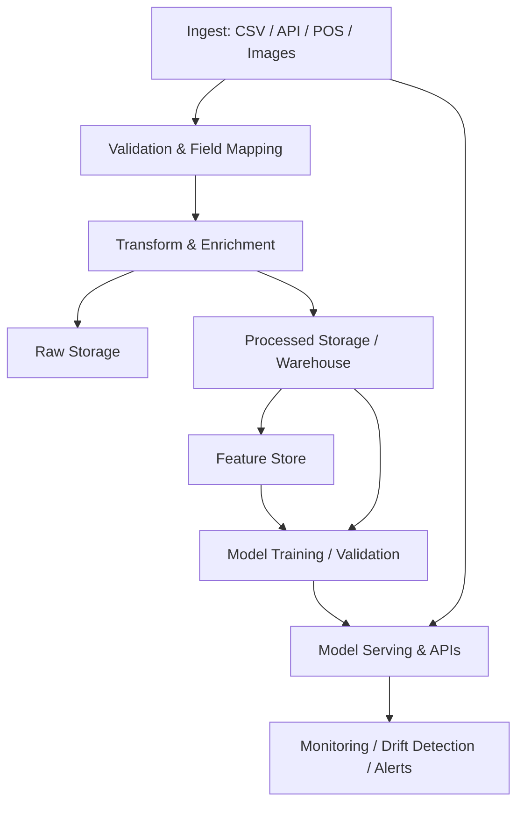

# AI-Driven Retail Analytics & Automation Platform

[](https://www.python.org/)
[](https://www.djangoproject.com/)
[](https://www.postgresql.org/)
[](https://redis.io/)
[](https://docs.celeryq.dev/)
[](https://www.tensorflow.org/)
[](https://pytorch.org/)
[](https://github.com/ultralytics/ultralytics)
[](LICENSE)

## 📌 Quick Summary

**AI-Driven Retail Analytics & Automation Platform** is a comprehensive Django‑based full‑stack solution for retail inventory management, demand forecasting, and business intelligence. It integrates machine learning for demand forecasting, computer vision for shelf analysis, and real‑time alerts to help retailers optimize stock levels, prevent stockouts, reduce overstocking, and gain actionable insights. The platform is designed for scalability, with support for multi‑store operations, automated data ingestion from POS/ERP systems, and a robust API for integration with external applications.

---

## 🎯 Overview

This platform addresses critical retail challenges:
- **Stockouts & Overstocking** – Prevent revenue loss through intelligent inventory management.
- **Manual Tracking** – Automate inventory operations with real‑time tracking.
- **Poor Forecasting** – Predict demand accurately using ML models.
- **Lack of Insights** – Generate actionable business intelligence through advanced analytics.

### Target Users
- Retail chains and independent stores
- Supply chain managers and inventory planners
- Operations teams needing real‑time visibility
- Data analysts and business intelligence teams
- Developers integrating retail data with other systems

---

## ✨ Key Features

### 1. Inventory Management
- Real‑time stock tracking per store/location
- Automated reorder point calculations
- Stock movement tracking between locations
- Low stock and overstock alerts
- Physical inventory count management

### 2. Product Management
- SKU and barcode tracking
- Multi‑supplier support
- Product categorization
- Cost and selling price management
- Automatic margin calculation

### 3. Order Management
- Sales order processing
- Purchase order generation
- Order line item tracking
- Status workflow management
- Order history and audit trail

### 4. Demand Forecasting (ML)
- Multiple forecasting models (ARIMA, LSTM, Prophet, Ensemble)
- Configurable training and validation
- Accuracy metrics (MAPE, RMSE, R²)
- Store and product‑level predictions
- Confidence intervals for forecasts

### 5. Computer Vision
- Product detection using YOLO
- Shelf analysis and compliance checking
- Real‑time stock level detection from images
- Stock visibility tracking
- Shelf quality scoring

### 6. Analytics & Insights
- Daily sales metrics aggregation
- Product‑level sales analytics
- Category performance analysis
- Inventory health reports
- AI‑generated business insights and recommendations

### 7. Alert System
- Configurable alert rules
- Multiple notification channels (Email, SMS, Slack, Webhook)
- Alert severity levels
- Alert acknowledgment and resolution tracking
- Alert history and audit trail

### 8. Data Ingestion
- Multi‑source data import (CSV, JSON, Excel, APIs, POS, ERP)
- Field mapping and transformation
- Data validation rules
- Batch processing
- Audit trail for imported data

---

## 🏗️ System Architecture

### High‑Level Design

```
Data Sources (POS, ERP, Excel, Images)
        ↓
Data Ingestion & ETL Layer
        ↓
Django REST Backend (APIs)
        ↓
PostgreSQL Database
        ↓
ML Services (Forecasting) | CV Services (Vision)
        ↓
REST APIs (Django REST Framework)
        ↓
Web Dashboard | Mobile Apps
        ↓
Real-time Alerts & Notifications
```

### System Architecture (Mermaid)

```mermaid
graph LR
  POS[POS / ERP / Excel / Images]
  ETL[Data Ingestion & ETL Layer]
  API[Django REST Backend (APIs)]
  DB[(PostgreSQL / SQLite)]
  ML[ML Services (Forecasting)]
  CV[CV Services (Vision)]
  UI[Web Dashboard / Mobile Apps]
  ALERTS[Real-time Alerts & Notifications]

  POS --> ETL --> API --> DB
  API --> ML
  API --> CV
  ML --> API
  CV --> API
  API --> UI
  API --> ALERTS
```

**Explanation:** Data flows from external sources into the ETL layer where it is validated and transformed, then ingested into the backend APIs and persisted in the primary database. ML and CV services consume API endpoints and data stores for training and inference. The REST API powers frontend apps and triggers alerts/notifications as needed.

### Data & ML Pipeline (Mermaid)



**Explanation:** The pipeline supports batch and streaming ingestion. Raw data is retained for auditability, processed data is stored for analytics and feature extraction, models are trained in isolated jobs and then served via APIs. Monitoring detects drift and triggers retraining or alerts.

---

## 🛠️ Tech Stack

| Layer                  | Technologies                                                                 |
|------------------------|------------------------------------------------------------------------------|
| **Backend**            | Python 3.8+, Django 4.2+, Django REST Framework, Celery                      |
| **Database**           | PostgreSQL 15+ (production), SQLite (development)                            |
| **Cache / Message Broker** | Redis 7+                                                                  |
| **Machine Learning**   | TensorFlow 2.13+, PyTorch 2.0+, Scikit-learn, Prophet, Statsmodels           |
| **Computer Vision**    | OpenCV, YOLOv8, Ultralytics                                                  |
| **Frontend (Web)**     | HTML5, CSS3, JavaScript, Bootstrap 5 (to be integrated with React later)     |
| **Mobile**             | React Native (planned)                                                        |
| **DevOps**             | Docker, Docker Compose, Nginx, Gunicorn                                      |
| **Monitoring**         | Prometheus, Grafana (optional)                                               |
| **Testing**            | Pytest, Coverage                                                             |

---

## 📁 Project Structure

```
retail_platform/
├── retail_core/           # Main Django project settings
├── products/              # Product management app
├── inventory/             # Inventory management app
├── orders/                # Orders & PO management
├── analytics/             # Sales analytics & insights
├── alerts/                # Alert system
├── ml_services/           # Machine learning (demand forecasting)
├── cv_services/           # Computer vision services
├── data_ingestion/        # ETL and data import
├── utils/                 # Utility functions
├── static/                # Static files
├── staticfiles/           # Collected static files
├── media/                 # User-uploaded files
│   ├── avatars/           # User avatars
│   └── uploads/           # General uploads
├── templates/             # HTML templates
├── tests/                 # Test cases
├── cv_models/             # Computer vision models
├── ml_models/             # Machine learning models
├── logs/                  # Application logs
├── manage.py              # Django CLI
├── requirements.txt       # Python dependencies
├── pytest.ini             # Pytest configuration
├── Dockerfile             # Docker configuration
├── docker-compose.yml     # Multi-container setup
├── db.sqlite3             # SQLite database (development)
└── README.md              # This file
```

---

## 🔧 Installation & Setup

### Prerequisites
- Python 3.8+
- PostgreSQL 15+ (for production) or SQLite (for development)
- Redis 7+
- Docker & Docker Compose (optional, recommended for production)

### Local Development

1. **Clone the repository**
   ```bash
   git clone <repository-url>
   cd retail_platform
   ```

2. **Create and activate virtual environment**
   ```bash
   python -m venv venv
   source venv/bin/activate  # On Windows: venv\Scripts\activate
   ```

3. **Install dependencies**
   ```bash
   pip install -r requirements.txt
   ```

4. **Configure environment variables**
   ```bash
   cp .env.example .env
   # Edit .env with your configuration (see Environment Variables section)
   ```

5. **Set up database**
   ```bash
   python manage.py migrate
   python manage.py createsuperuser
   ```

6. **Run development server**
   ```bash
   python manage.py runserver
   ```

7. **Start Celery (in another terminal)**
   ```bash
   celery -A retail_core worker -l info
   celery -A retail_core beat -l info   # for periodic tasks
   ```

Access the application at `http://localhost:8000`

### Docker Installation (Recommended for Production)

```bash
docker-compose up -d
```

This will start:
- Django application (port 8000)
- PostgreSQL database
- Redis cache
- Celery worker
- Celery Beat scheduler

---

## 🔐 Environment Variables

Key configuration options in `.env`:

```
# Django Settings
DEBUG=True
SECRET_KEY=your-secret-key-here-change-in-production
ALLOWED_HOSTS=localhost,127.0.0.1

# Database Configuration (PostgreSQL)
DB_ENGINE=django.db.backends.postgresql
DB_NAME=retail_db
DB_USER=retail_user
DB_PASSWORD=retail_password
DB_HOST=localhost
DB_PORT=5432

# Redis Configuration
REDIS_URL=redis://localhost:6379/0

# Celery Configuration
CELERY_BROKER_URL=redis://localhost:6379/0
CELERY_RESULT_BACKEND=redis://localhost:6379/0

# CORS Settings
CORS_ALLOWED_ORIGINS=http://localhost:3000,http://localhost:8000

# JWT Settings
JWT_SECRET_KEY=your-jwt-secret-key-here
JWT_ALGORITHM=HS256

# Email Configuration
EMAIL_BACKEND=django.core.mail.backends.console.EmailBackend
EMAIL_HOST=smtp.gmail.com
EMAIL_PORT=587
EMAIL_HOST_USER=your-email@gmail.com
EMAIL_HOST_PASSWORD=your-app-password

# ML/CV Configuration
ML_MODELS_DIR=./ml_models
CV_MODELS_DIR=./cv_models
```

---

## 📊 API Endpoints

All endpoints are prefixed with `/api/v1/`. Authentication is via JWT (Bearer token).

### Products
| Method | Endpoint | Description |
|--------|----------|-------------|
| GET    | `/products/` | List products (paginated) |
| POST   | `/products/` | Create a new product |
| GET    | `/products/{id}/` | Retrieve product details |
| PUT    | `/products/{id}/` | Full update |
| PATCH  | `/products/{id}/` | Partial update |
| DELETE | `/products/{id}/` | Delete product |

### Inventory
| Method | Endpoint | Description |
|--------|----------|-------------|
| GET    | `/inventory/levels/` | Current stock levels (filter by store, product) |
| POST   | `/inventory/transactions/` | Record stock movement (sale, receipt, adjustment) |
| GET    | `/inventory/transfers/` | List stock transfers between locations |
| POST   | `/inventory/transfers/` | Create a stock transfer |

### Orders
| Method | Endpoint | Description |
|--------|----------|-------------|
| GET    | `/orders/` | List sales/purchase orders |
| POST   | `/orders/` | Create order |
| GET    | `/orders/{id}/` | Order details |
| POST   | `/orders/{id}/ship/` | Mark order as shipped |

### Analytics
| Method | Endpoint | Description |
|--------|----------|-------------|
| GET    | `/analytics/daily-metrics/` | Aggregated daily sales metrics |
| GET    | `/analytics/product-analytics/` | Product performance (sales, margin) |
| GET    | `/analytics/forecasts/` | Demand forecasts for products |
| GET    | `/analytics/insights/` | AI‑generated business insights |

### Alerts
| Method | Endpoint | Description |
|--------|----------|-------------|
| GET    | `/alerts/` | List alerts (active/history) |
| POST   | `/alerts/{id}/acknowledge/` | Acknowledge an alert |
| POST   | `/alerts/{id}/resolve/` | Resolve an alert |

### Forecasting (ML)
| Method | Endpoint | Description |
|--------|----------|-------------|
| POST   | `/forecasting/train/` | Trigger model training (async) |
| GET    | `/forecasting/models/` | List available trained models |
| POST   | `/forecasting/predict/` | Get predictions for a product (requires model ID) |

### Computer Vision
| Method | Endpoint | Description |
|--------|----------|-------------|
| POST   | `/vision/detect-stock/` | Upload image, detect products and estimate stock |
| POST   | `/vision/analyze-shelf/` | Analyze shelf compliance (facing, gaps) |
| GET    | `/vision/results/` | Retrieve previous analysis results |

### Data Ingestion
| Method | Endpoint | Description |
|--------|----------|-------------|
| POST   | `/data-ingestion/sources/` | Register a new data source (e.g., FTP, API) |
| POST   | `/data-ingestion/import/` | Trigger an import job (sync) |
| GET    | `/data-ingestion/jobs/` | List import jobs |
| GET    | `/data-ingestion/jobs/{id}/` | Job details and logs |

### Authentication
| Method | Endpoint | Description |
|--------|----------|-------------|
| POST   | `/api/token/` | Obtain JWT access/refresh tokens |
| POST   | `/api/token/refresh/` | Refresh access token |

---

## 🔐 Authentication

The API uses JWT (JSON Web Tokens). Obtain tokens:

```bash
curl -X POST http://localhost:8000/api/token/ \
  -H "Content-Type: application/json" \
  -d '{"username": "your_username", "password": "your_password"}'
```

Response:
```json
{
  "access": "eyJhbGciOiJIUzI1NiIsInR5cCI6IkpXVCJ9...",
  "refresh": "eyJhbGciOiJIUzI1NiIsInR5cCI6IkpXVCJ9..."
}
```

Include the access token in subsequent requests:
```bash
curl -H "Authorization: Bearer <access_token>" \
  http://localhost:8000/api/v1/products/
```

---

## 🧪 Testing

```bash
# Run all tests
pytest

# Run tests with coverage report
pytest --cov=. --cov-report=html

# Run tests for a specific app
pytest products/

# Run a specific test class
pytest tests/test_models.py::TestProductModel
```

Test files are located in the `tests/` directory, mirroring the app structure.

---

## 📈 Performance Considerations

- **Database Indexing**: Indexes are configured on frequently queried fields (e.g., `product.sku`, `inventory.store_id`).
- **Caching**: Redis caches computed analytics and frequently accessed data (e.g., product lists).
- **Batch Processing**: Celery tasks handle bulk operations (e.g., data ingestion, model training) asynchronously.
- **Pagination**: All list endpoints return paginated results (50 items per page by default).
- **Query Optimization**: Use `select_related()` and `prefetch_related()` in Django ORM to reduce database queries.

---

## 🐛 Troubleshooting

### Database Connection Issues
```bash
# Check PostgreSQL is running
psql -U retail_user -d retail_db -h localhost

# Reset database (if needed)
python manage.py migrate 0001
python manage.py migrate
```

### Redis Connection Issues
```bash
# Verify Redis is running
redis-cli ping   # Should return PONG
```

### Celery Not Processing Tasks
```bash
# Check Celery worker logs
celery -A retail_core worker -l info

# Purge old tasks (if stuck)
celery -A retail_core purge -f
```

### ML/CV Model Loading Errors
- Ensure model files are placed in the correct directories (`ml_models/`, `cv_models/`).
- Verify file permissions.
- Check that required dependencies (TensorFlow, PyTorch, Ultralytics) are installed.

---

## 🚀 Deployment

### Heroku
```bash
heroku create retail-analytics-app
heroku addons:create heroku-postgresql:standard-0
heroku addons:create heroku-redis:hobby-dev
heroku config:set SECRET_KEY=your-secret-key
heroku config:set DJANGO_SETTINGS_MODULE=retail_core.settings.production
git push heroku main
heroku run python manage.py migrate
```

### AWS (EC2 + RDS + ElastiCache)
- **EC2**: Application server with Gunicorn + Nginx.
- **RDS**: PostgreSQL managed database.
- **ElastiCache**: Redis cluster.
- **S3**: Media storage for uploaded images.
- **CloudFront**: CDN for static/media files.

### Docker (Any Cloud)
```bash
docker-compose -f docker-compose.yml --env-file .env.production up -d
```

Ensure proper environment variables and secrets management (e.g., using AWS Secrets Manager, HashiCorp Vault).

---

## 📖 Documentation

- **Interactive API Docs**: Available at `/api/docs/` (Swagger UI) and `/api/redoc/` (ReDoc) when `DEBUG=True`.
- **Django Admin**: `/admin/` for managing data (users, products, inventory, etc.).
- **Data Model Diagram**: See [docs/models.md](docs/models.md) for detailed schema.
- **ML Pipeline**: See [docs/ml_pipeline.md](docs/ml_pipeline.md) for forecasting workflow.
- **CV Services**: See [docs/cv_services.md](docs/cv_services.md) for computer vision details.

---

## 🤝 Contributing

We welcome contributions! Please follow these steps:

1. Fork the repository.
2. Create a feature branch: `git checkout -b feature/your-feature`
3. Commit changes: `git commit -am 'Add your feature'`
4. Push to branch: `git push origin feature/your-feature`
5. Submit a pull request.

### Guidelines
- Write tests for new functionality.
- Ensure code passes linting (flake8, black).
- Update documentation as needed.
- Keep pull requests focused on a single feature/fix.

---

## 📄 License

This project is licensed under the MIT License – see the [LICENSE](LICENSE) file for details.

---

## 👨‍💻 Author & Contact

**Manish Sharma**  
📍 Ghaziabad, Uttar Pradesh, India  
📞 +91 7982682852  
📧 [manishsharma93155@gmail.com](mailto:manishsharma93155@gmail.com)  
🔗 [LinkedIn](https://www.linkedin.com/in/themanishpndt)  
💻 [GitHub](https://github.com/themanishpndt)  
🌐 [Portfolio](https://themanishpndt.github.io/Portfolio/)

---

## 🗓️ Roadmap

- [ ] Real‑time dashboard with WebSockets (Django Channels)
- [ ] Mobile app (React Native)
- [ ] Advanced predictive maintenance for equipment
- [ ] Supplier performance analytics
- [ ] Customer segmentation and churn prediction
- [ ] Dynamic pricing recommendations
- [ ] Integration with major POS systems (Square, Shopify, etc.)
- [ ] Multi‑language support
- [ ] Advanced report generation (PDF, Excel)
- [ ] AI‑powered chatbot for inventory queries

---

## 🎉 Acknowledgments

Built with:
- Django & Django REST Framework
- PostgreSQL, Redis, Celery
- TensorFlow, PyTorch, Scikit‑learn
- OpenCV, YOLOv8
- React (planned frontend)

---

If you find this project useful, please ⭐ the repository on GitHub! 🙌